# Ukraine Wiki — Build Spec

A plan to turn this project into a **Wikipedia-style interlinked encyclopedia**
about Ukraine: a repository of *terms*, each with its own page, where the first
mention of any known term on any page auto-links to that term's page.

---

## 1. Locked decisions

| Area | Decision |
|---|---|
| Content model | Entity/term pages (a knowledge graph), not article cards |
| Data sources | **Hybrid**: Wikidata + Wikipedia backbone, enriched by web search |
| Quality | **Grounded + verified + cited** (RAG, no "from memory") |
| Link density | **First mention per page** (Wikipedia convention) |
| Term backbone | **Wikidata-driven** entities + aliases, enriched by LLM |
| Canonical key | **Wikidata QID** (kills duplicates permanently) |
| Home page | **Encyclopedia portal** (search + categories + featured/recent) |
| Initial seed | **~300–500** high-notability terms, then grow via red links |
| Red links | **Gated**: auto-queue only if the term is a notable Wikidata QID |
| Search | **Pagefind** static index |
| Attribution | Wikipedia/Wikidata = CC BY-SA → per-page References + footer credit |

---

## 2. Architecture

```mermaid
flowchart TD
  S[SPARQL seed by notability<br/>~300-500 QIDs] --> T[(terms.json<br/>QID, slug, aliases, type, categories)]
  T --> Q{Work queue<br/>by status}
  Q --> G[gather: Wikipedia REST + Wikidata facts<br/>+ web search, cached per QID]
  G --> Y[synthesize: grounded RAG →<br/>page JSON + wikilinks + infobox + sources]
  Y --> V[verify: completeness + schema + dedupe]
  V --> P[(pages/&#42;.json<br/>one per QID)]
  P --> L[resolve_links: alias→slug map,<br/>first-mention linking, backlinks]
  L --> R[red links discovered] -->|notable QID?| Q
  L --> B[build: Astro /wiki/&#91;slug&#93; + Pagefind]
```



Pipeline stages are **idempotent** and driven by a `status` field per term
(`queued → gathered → synthesized → published`) so runs resume and skip work.

---

## 3. Data model

### 3.1 `data-wiki/terms.json` (the dictionary)
```json
{
  "qid": "Q1899",
  "slug": "kyiv",
  "name": "Kyiv",
  "type": "city",
  "aliases": ["Kiev", "Kyïv", "capital of Ukraine"],
  "categories": ["land-geography", "government-politics"],
  "notability": 210,
  "status": "published"
}
```
- `slug` derived from `name` (unique; suffix on collision).
- `aliases` from Wikidata `altLabel` + generated inflections (plural/possessive) + common transliterations.
- `notability` = Wikipedia sitelink count (and/or pageviews) used for ranking + the red-link gate.

### 3.2 `data-wiki/pages/<qid>.json` (one page per term)
```json
{
  "qid": "Q1899",
  "slug": "kyiv",
  "title": "Kyiv",
  "type": "city",
  "aliases": ["Kiev", "Kyïv"],
  "categories": ["land-geography"],
  "infobox": {
    "label": "City in Ukraine",
    "image": null,
    "fields": [
      { "label": "Population", "value": "2,952,301", "source": "wikidata:P1082" },
      { "label": "Founded", "value": "482 AD", "source": "wikidata:P571" }
    ]
  },
  "summary": "Kyiv is the capital and largest city of Ukraine…",
  "sections": [
    { "heading": "History", "paragraphs": ["…", "…"] }
  ],
  "links_out": ["dnieper", "kyivan-rus", "holodomor"],
  "sources": [
    { "title": "Kyiv", "url": "https://en.wikipedia.org/wiki/Kyiv", "license": "CC BY-SA 4.0" }
  ],
  "updated_at": "2026-08-09",
  "status": "published"
}
```

### 3.3 Derived at build: link graph
- `links_out` per page (from linking pass).
- `backlinks[slug] = [slug, …]` — powers "What links here".
- `categories[catSlug] = [slug, …]` — powers category pages.
- `redlinks[]` — mentions that matched a notable QID with no page yet → next queue.

---

## 4. Pipeline scripts (Python, reuse `.env` OPENAI_API_KEY)

All live in `wiki/` at repo root. Each is runnable standalone and idempotent.

### 4.1 `seed_terms.py` — Wikidata seed by notability
- Runs SPARQL for places (`P17=Q212`), people (`P27=Q212`), events
  (`P276`/`P585` in Ukraine), organizations, and key concepts.
- Ranks by sitelink count; keeps top N per type to hit ~300–500 total.
- Writes `terms.json` (status `queued`). Assigns categories from `type` +
  Wikidata "instance of"/"subclass of" mapping to your 10 sections.

```sparql
SELECT ?item ?itemLabel (COUNT(?sitelink) AS ?links) WHERE {
  ?item wdt:P17 wd:Q212 .
  ?sitelink schema:about ?item .
  SERVICE wikibase:label { bd:serviceParam wikibase:language "en". }
} GROUP BY ?item ?itemLabel ORDER BY DESC(?links) LIMIT 500
```

### 4.2 `gather.py` — collect grounded sources (cached per QID)
- Wikipedia REST: `/page/summary/{title}` + full sections via the MediaWiki
  `parse`/`extracts` API.
- Wikidata entity JSON → raw claims for the infobox.
- Web search (hybrid): OpenAI web search or Tavily for recency/enrichment,
  especially war/current-events terms.
- Caches everything under `wiki/cache/<qid>/` so re-runs are free.

### 4.3 `synthesize.py` — grounded RAG → page JSON
- Prompt rules: *use ONLY provided sources; paraphrase; preserve every fact,
  figure, date; insert `[[wikilink]]` markup for known terms; output JSON schema.*
- **Structured Outputs** (JSON schema) guarantee the page shape.
- **Deterministic infobox**: mapped straight from Wikidata claims (no LLM), so
  numbers are never lost (fixes the earlier missing-facts issue).
- Model tiering: draft with a small model, verify/synthesize sensitive pages
  with a stronger one. Optionally OpenAI **Batch API** for big cheap runs.

Infobox property map (per type):

| Type | Wikidata properties |
|---|---|
| City | `P1082` pop, `P2046` area, `P625` coords, `P2044` elev, `P6` mayor |
| Person | `P569` born, `P570` died, `P19` birthplace, `P39` positions |
| Event | `P585` date, `P276` location, `P710` participants |
| Org | `P571` inception, `P159` HQ, `P527` members |

### 4.4 `verify.py` — accuracy + dedupe gate
- Completeness check: extract key entities/numbers from sources; confirm they
  appear; re-prompt to fill gaps.
- JSON-schema validation.
- **Embedding dedupe** (`text-embedding-3-small`): skip/merge near-duplicates;
  QID key already prevents alias duplicates.

### 4.5 `resolve_links.py` — the auto-linking engine
- Build global **alias → slug** map; compile Aho-Corasick automaton.
- For each page, link the **first** matching mention per slug; then mark done.
- Guards: skip headings/existing links/infobox/self-links; longest-match wins;
  word-boundary + case-insensitive; **stop-list** of common words; handle
  plurals/possessives.
- Disambiguation: multiple QIDs for one surface form → pick by page
  category/context (LLM tie-break) or link to a disambiguation page.
- Emit `links_out`, `backlinks`, and the **red-link queue** (notable QID, no
  page yet) back into `terms.json` as new `queued` rows.

### 4.6 `export.py` — publish to the site
- Writes `web/src/data/wiki/pages/<slug>.json` + `index.json` (list) +
  `redirects.json` (alias → slug) + `graph.json` (backlinks/categories).
- The web app reads these; a `sync-data` step keeps them fresh.

### 4.7 `run.py` — orchestrator
- Processes the queue with concurrency + rate-limit + retry/backoff.
- Checkpoints; `--limit N` per run; resumes on `status`.
- After each batch, re-runs `resolve_links` to surface new red links → growth.

---

## 5. Astro site changes

### Routes
- `/` — **portal**: search bar (Pagefind), category grid, featured term
  (Ukraine `Q212`), recently added, random-article link, A–Z link.
- `/wiki/[slug]` — term page: lead, infobox (aside), auto-linked body,
  References, Categories, **What links here** (backlinks).
- `/category/[slug]` — terms in a category (your 10 sections become categories).
- `/a-z` — alphabetical index of all terms.
- `/disambiguation/[slug]` — when a surface form has multiple senses.
- Alias **redirects** (`/wiki/kiev` → `/wiki/kyiv`) from `redirects.json`.

### Components
- `Infobox.astro`, `WikiBody.astro` (renders paragraphs with pre-resolved
  links), `Backlinks.astro`, `References.astro`, `CategoryChips.astro`,
  `Search.astro` (Pagefind UI), `Portal*` sections.
- Keep the current **minimal design + dark mode**; retire the feed/section/topic
  pages (or repurpose the feed as `/recent`).

### Content layer
- One JSON per page (scales better than a single giant file); load via a small
  loader or Astro Content Collections. Build `backlinks`/`categories` once at
  startup from `graph.json`.

### Search
- **Pagefind**: index `dist` after build (`postbuild` script); ship its static
  index + UI. Scales to thousands of pages.

### Migration of current content
- Existing 2 articles become the **Ukraine** (`Q212`) and **Russia–Ukraine War**
  (`Q110999040`) root pages, regenerated through the grounded pipeline.

---

## 6. Config, cost, scale

- `.env`: `OPENAI_API_KEY` (have it), optional `TAVILY_API_KEY` (or use OpenAI
  web search), `OPENAI_MODEL`, `OPENAI_MODEL_VERIFY`, `EMBED_MODEL`.
- Cost controls: cache raw sources, small model for drafts, embeddings dedupe,
  Batch API for bulk, `--limit` per run, skip `published`.
- Build performance: per-page JSON + Pagefind; incremental generation.
- Licensing: CC BY-SA attribution in footer + per-page References.

---

## 7. Directory layout (new)

```
wiki/                     # generation pipeline (python)
  seed_terms.py
  gather.py
  synthesize.py
  verify.py
  resolve_links.py
  export.py
  run.py
  cache/<qid>/…           # cached raw sources
data-wiki/
  terms.json
  pages/<qid>.json
web/src/
  data/wiki/…             # published JSON consumed by Astro
  pages/wiki/[slug].astro
  pages/category/[slug].astro
  pages/a-z.astro
  components/wiki/*.astro
```

---

## 8. Phased implementation

- **Phase 0 — Skeleton:** `seed_terms.py` → review ~300 terms in `terms.json`.
- **Phase 1 — One page end-to-end:** gather→synthesize→verify→export for
  `Kyiv`; new `/wiki/[slug]` route + Infobox/References render it.
- **Phase 2 — Linking:** `resolve_links.py` (alias map, first-mention, backlinks)
  + `WikiBody` renders links; "What links here" works.
- **Phase 3 — Batch + growth:** orchestrator runs the seed; red-link gate feeds
  new terms; dedupe verified.
- **Phase 4 — Portal + search:** home portal, categories, A–Z, Pagefind.
- **Phase 5 — Polish:** disambiguation, redirects, freshness cron, attribution.

---

## 9. Risks & mitigations

| Risk | Mitigation |
|---|---|
| Wikidata scope explosion | Notability ranking + seed cap + gated red links |
| Hallucinated facts | Grounded RAG + deterministic infobox + verify pass |
| Duplicate terms | QID canonical key + embedding dedupe |
| Wrong-sense links | Category/context disambiguation + disambiguation pages |
| Over-linking noise | First-mention-only + stop-list + word-boundary rules |
| Build time at scale | Per-page JSON + Pagefind + incremental runs |
| Cost | Caching, model tiering, Batch API, `--limit` |

---

## 10. Open questions (for later)
- Images: pull from Wikimedia Commons (licensing per file) or text-only first?
- Ukrainian-language content / bilingual pages?
- Editorial review UI before publishing, or fully automated?
- Freshness cadence for war/news vs. static history pages.
